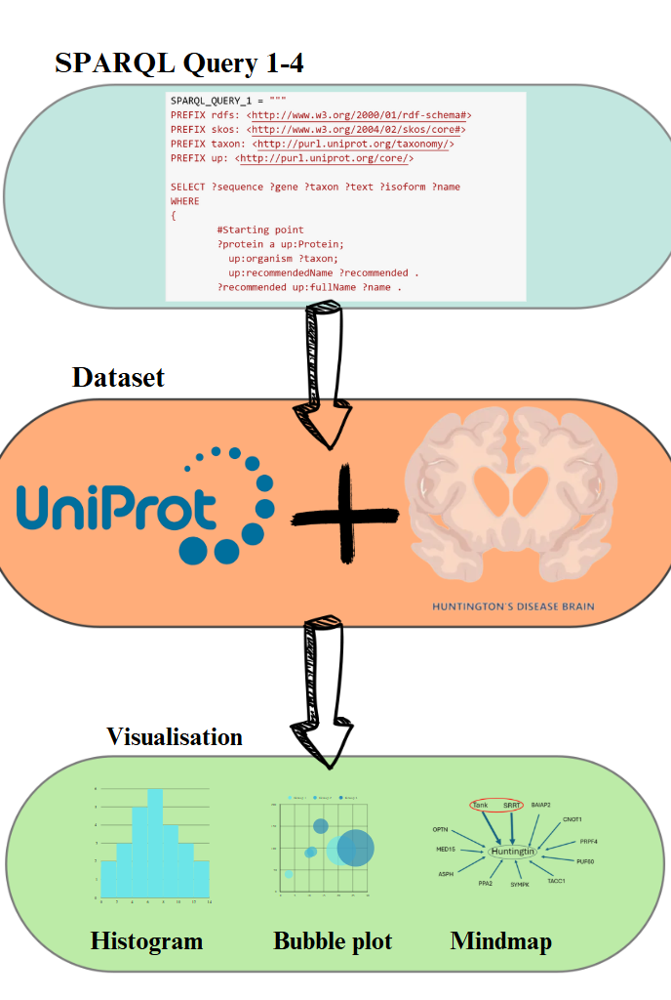

## Huntington's disease in Uniprot
 
A disease which has been greatly annotated in UniProt, is Huntington’s disease. Huntington’s disease is a debilitating neurodegenerative disorder due to a gain of function by the mutant huntingtin protein. 
With the help of UniProt research can be done on the huntingtin protein, and its interaction with other molecules. 
 
 

 

## SPARQL queries
 
A total of four SPARQL queries were used to gather information about Huntington's disease from UniProt. All four queries can be found in the file Sparql_queries.
To run these SPARQL queries in Python, a function was created, which can be found in the file Sparql_function.
After running the SPARQL queries, the dataframes were organized. This code can be found in the file Explore_dataframe.
 
 

## Visualisation Uniprot data
 
Finally, to visualize the information gathered from UniProt, histograms and a bubble plot were created. The code for both can be found in the file Visualisation_dataframes.

